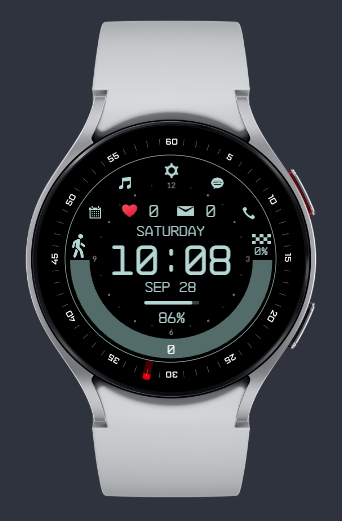
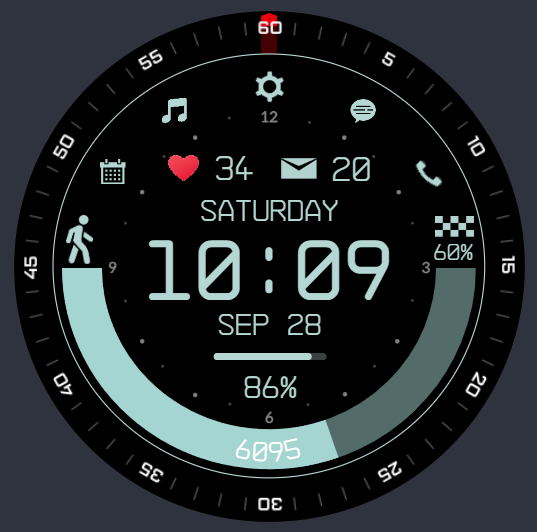
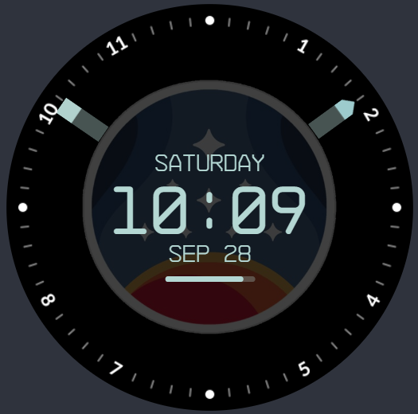
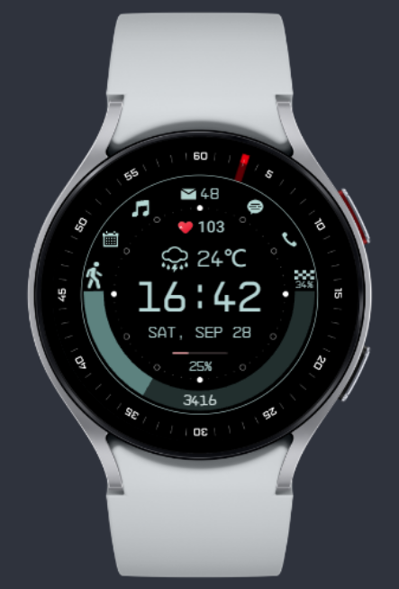

# 星空主题表盘

**本表盘仅在三星 Watch4 上进行测试，其他手表暂未测试**。

`apk` 安装包在 `./pkg/`路径下，可通过 [WearOS工具箱](https://wearosbox.com/) 安装

开发平台：[WatchFaceStudio](https://developer.samsung.com/watch-face-studio/download.html) 

[演示视频](https://www.bilibili.com/video/BV1YkHmeKETb)

# 版本问题

工程文件：

- `Starfiled_for_4_v1.wfs`：支持watch4及以上版本手表，Watch4 以下未测试

- `StarfiledLike_for_5_v1.wfs`：因为调用了天气接口，至少 Watch4 已经不支持了

# 效果图

## Starfiled_for_4_v1

特色：

- 支持秒针显示

- 动态心跳

- 充电-充满电-低电量特殊显示

- 步数达标时百分比变为绿色

- 息屏显示支持分钟、小时指示

- 支持五种功能按钮：日历、媒体、设置、短信、电话

## StarfiledLike_for_5_v1

特色：

- 加入天气图标和气温显示，根据不同天气情况切换天气图标
- 调整布局

不足：

- 熄屏显示未设置时针、分针

可能存在问题：

- 秒针位置未正确对齐

对于潜在的问题您可自行调整并欢迎提交PR。

由于本人没有watch4以上设备故无法深入测试，并且由于最新版开发平台不支持 Watch4 开发，因此暂停此表盘维护，仅支持 `Starfiled_for_4` 表盘维护。

# 支持一下

欢迎star，共同开发，或请我喝杯饮料

